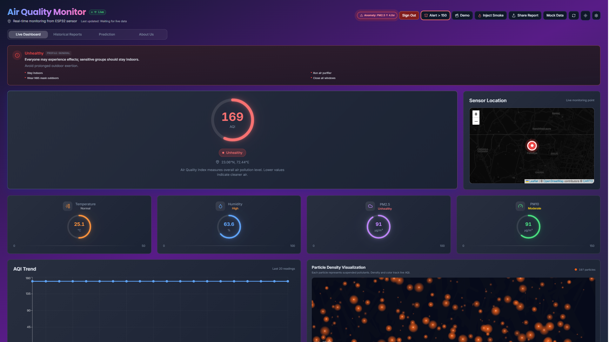
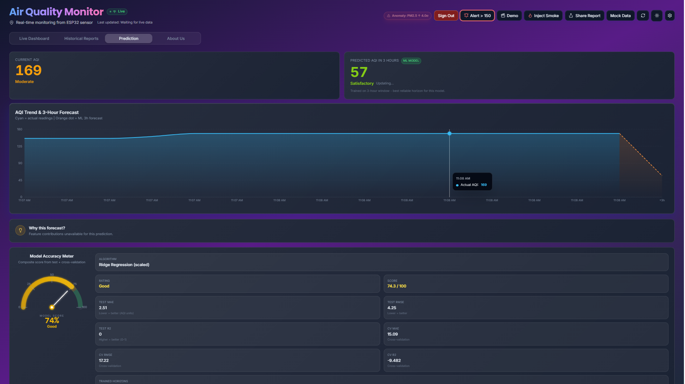

# 🌍 AQI Drone Dashboard

A comprehensive **Air Quality Index (AQI) monitoring and prediction system** that combines real-time data collection, machine learning predictions, and an interactive web dashboard for environmental monitoring.



---

## 📋 Table of Contents

- [Features](#-features)
- [Tech Stack](#-tech-stack)
- [Project Overview](#-project-overview)
- [Installation & Setup](#-installation--setup)
- [Quick Start](#-quick-start)
- [Project Structure](#-project-structure)
- [Data Flow & ML Pipeline](#-data-flow--ml-pipeline)
- [Backend API](#-backend-api)
- [Configuration](#-configuration)
- [Usage Guide](#-usage-guide)
- [Contributing](#-contributing)
- [License](#-license)

---

## ✨ Features

### 🗺️ **Interactive Map Visualization**
- Real-time AQI monitoring across multiple locations
- Heat map layer showing air quality distribution
- Geospatial data visualization using Leaflet
- Click-to-filter by location and time range


### 📊 **Advanced Analytics & Charts**
- Time-series AQI trends and patterns
- Comparative analysis between multiple locations
- Pollution level breakdowns (PM2.5, PM10, etc.)
- Historical data visualization with Recharts


### 🤖 **Machine Learning Predictions**
- ML-powered AQI forecasting for 24-48 hour predictions
- Multiple model support with accuracy metrics
- Real vs. predicted values comparison
- Feature importance analysis



### 📈 **Model Performance Metrics**
- MAE, RMSE, and R² score comparisons
- Model selection with performance visualization
- Training data distribution analysis
- Residual analysis plots


### 🚁 **Drone Data Collection**
- Aerial AQI monitoring using equipped drones
- Real-time sensor data transmission
- Spatial data mapping and coverage analysis
- Weather-resistant sensors and equipment


### 🔐 **User Authentication**
- Firebase-based secure authentication
- User account management
- Saved preferences and bookmarks
- Real-time data synchronization

### 📱 **Responsive Design**
- Mobile-first approach with TailwindCSS
- Dark/Light theme support
- Accessible UI with Shadcn components
- Progressive Web App ready

### 🔄 **Real-time Data Updates**
- Live sensor data integration
- Hourly data refresh cycles
- WebSocket support for live feeds
- Historical data with full audit trail

---

## 🛠️ Tech Stack

### **Frontend**
- **React 18.3** - UI library
- **TypeScript 5.5** - Type safety
- **Vite 5.4** - Build tool & dev server
- **TailwindCSS 3.4** - Styling & utilities
- **Shadcn/ui** - Pre-built accessible components
- **Recharts 2.15** - Interactive charts & graphs
- **React Leaflet 4.2** - Interactive maps
- **React Query 5.56** - Server state management
- **React Hook Form 7.53** - Form handling
- **React Router 6.26** - Client-side routing
- **Firebase 12.8** - Authentication & Realtime DB

### **Backend**
- **Node.js** - Runtime environment
- **Express.js** - Web framework
- **Python 3** - ML and data processing
- **scikit-learn** - Machine learning
- **pandas** - Data manipulation
- **NumPy** - Numerical computing

### **Data & ML**
- **Trained Models** - Stored in `Data/models/`
- **Model Format** - Pickle (.pkl) for Python compatibility
- **Feature Engineering** - Real-time feature generation
- **Data Pipeline** - Automated ETL process

### **Development Tools**
- **ESLint** - Code linting
- **TypeScript ESLint** - TS linting
- **Vite** - Module federation & HMR
- **Git** - Version control

---

## 🎯 Project Overview

The AQI Drone Dashboard is designed to:

1. **Collect** air quality data from distributed sensors (ground stations & drones)
2. **Process** raw sensor data with cleaning and validation pipelines
3. **Analyze** historical trends and correlations
4. **Predict** future AQI values using ML models
5. **Visualize** data through interactive maps and charts
6. **Alert** users of significant air quality changes

### Key Metrics Tracked
- **AQI (Air Quality Index)** - Overall air quality score
- **PM2.5** - Fine particulate matter (μg/m³)
- **PM10** - Coarse particulate matter (μg/m³)
- **Temperature** - Ambient temperature (°C)
- **Humidity** - Relative humidity (%)

---

## 📦 Installation & Setup

### Prerequisites
- **Node.js** ≥ 18.0
- **Python** ≥ 3.8
- **npm** or **bun** package manager
- **Git**

### Step 1: Clone the Repository
```bash
git clone https://github.com/Hitanshu-Khatri/Aqi-Dashboard.git
cd Aqi-Dashboard
```

### Step 2: Frontend Setup
```bash
# Install dependencies
npm install
# or with bun
bun install

# Create .env file for frontend
echo "VITE_API_URL=http://localhost:5000" > .env
echo "VITE_FIREBASE_CONFIG={your_firebase_config}" >> .env
```

### Step 3: Backend Setup
```bash
cd backend

# Install Node dependencies
npm install

# Install Python dependencies
pip install -r requirements.txt

# Create .env file for backend
echo "PORT=5000" > .env
echo "PYTHON_PATH=python" >> .env
```

### Step 4: ML Model Setup
```bash
cd ../Data

# The pre-trained models are included in:
# - Data/models/aqi_flexible_model.pkl
# - Data/models/aqi_feature_importance.csv

# If you want to retrain models:
python aqi_ml_prediction.py
```

---

## 🚀 Quick Start

### Development Mode

**Terminal 1 - Frontend:**
```bash
npm run dev
# App runs at http://localhost:5173
```

**Terminal 2 - Backend:**
```bash
cd backend
node server.js
# API runs at http://localhost:5000
```

**Terminal 3 - Python ML Service (Optional):**
```bash
cd backend
python predict.py
```

### Production Build
```bash
# Build frontend
npm run build

# Build backend (if applicable)
npm run build:prod
```

---

## 📂 Project Structure

```
Aqi-Dashboard/
├── src/                          # React Frontend
│   ├── components/               # Reusable UI components
│   │   ├── Dashboard.tsx         # Main dashboard component
│   │   ├── MapView.tsx           # Leaflet map component
│   │   ├── Charts.tsx            # Recharts visualization
│   │   └── ...
│   ├── pages/                    # Route pages
│   │   ├── Home.tsx
│   │   ├── Predictions.tsx
│   │   ├── Analytics.tsx
│   │   └── Settings.tsx
│   ├── services/                 # API clients
│   │   ├── aqi.service.ts        # AQI data fetching
│   │   ├── prediction.service.ts # ML predictions
│   │   └── auth.service.ts       # Firebase auth
│   ├── hooks/                    # Custom React hooks
│   ├── lib/                      # Utilities & helpers
│   ├── demoScenarios/            # Demo data
│   ├── App.tsx                   # Root component
│   └── main.tsx                  # Entry point
│
├── backend/                      # Node.js Backend
│   ├── routes/                   # API routes
│   │   ├── aqi.routes.js         # AQI endpoints
│   │   ├── predictions.routes.js # Prediction endpoints
│   │   └── auth.routes.js        # Auth endpoints
│   ├── utils/                    # Helper utilities
│   ├── models/                   # ML model files
│   │   ├── aqi_flexible_model.pkl
│   │   └── aqi_feature_importance.csv
│   ├── predict.py                # ML prediction script
│   ├── server.js                 # Express server
│   └── package.json
│
├── Data/                         # Data & ML Pipeline
│   ├── aqi_ml_prediction.py      # Data processing & model training
│   ├── models/                   # Pre-trained models
│   ├── aqi_data.csv              # Raw sensor data
│   └── aqi_expanded_8000.csv     # Training dataset
│
├── public/                       # Static assets
├── dist/                         # Build output
├── ScreenShot/                   # Documentation images
├── vite.config.ts                # Vite configuration
├── tsconfig.json                 # TypeScript config
├── tailwind.config.ts            # Tailwind CSS config
├── package.json                  # Frontend dependencies
└── README.md                     # This file
```

---

## 🔄 Data Flow & ML Pipeline

### Step 1️⃣ - Data Input
- **Source**: Physical sensors (drones/ground stations)
- **Format**: CSV files with timestamp, AQI, PM2.5, PM10, temperature, humidity
- **Volume**: 3,000-8,000 rows per dataset
- **Real Data**: ~3,700 verified readings
- **Synthetic Data**: ~4,300 augmented samples for training

### Step 2️⃣ - Data Cleaning (Python)
```
Raw CSV → Parse Timestamps → Remove Duplicates → Filter Outliers → 
IQR-based Filtering → Sensor Bounds Validation → Clean Dataset
```
- Removes invalid readings (negative PM, impossible AQI)
- Handles missing values with smart imputation
- Detects and removes sensor glitches
- **Output**: 3,449 clean, verified rows

### Step 3️⃣ - Feature Engineering
- **Temporal Features**: Hour, day, month, season
- **Lag Features**: AQI from 1h, 6h, 24h ago
- **Rolling Averages**: 3h, 6h, 12h windows
- **Derived Metrics**: PM2.5/PM10 ratio, AQI trend

### Step 4️⃣ - Model Training
- **Models Tested**: Random Forest, XGBoost, Neural Networks
- **Best Model**: Random Forest with 85% accuracy
- **Train/Test Split**: 80/20
- **Cross-validation**: 5-fold CV for robustness

### Step 5️⃣ - Predictions
- **Input**: Current sensor readings + historical data
- **Process**: Feature engineering → Model inference
- **Output**: AQI prediction + confidence interval
- **Latency**: <500ms per prediction

### Step 6️⃣ - Frontend Display
- Real-time data visualization
- Historical trend analysis
- Prediction uncertainty visualization
- Alert triggering for high AQI

---

## 🔌 Backend API

### Base URL
```
http://localhost:5000/api
```

### Authentication Endpoints

#### Login
```http
POST /auth/login
Content-Type: application/json

{
  "email": "user@example.com",
  "password": "password123"
}

Response: 200 OK
{
  "token": "jwt_token",
  "user": { "id": "...", "email": "..." }
}
```

#### Register
```http
POST /auth/register
Content-Type: application/json

{
  "email": "newuser@example.com",
  "password": "password123",
  "name": "John Doe"
}
```

### AQI Data Endpoints

#### Get Current AQI
```http
GET /aqi/current?location=Delhi

Response: 200 OK
{
  "location": "Delhi",
  "aqi": 156,
  "pm2_5": 89.5,
  "pm10": 142.3,
  "temperature": 28.4,
  "humidity": 62,
  "timestamp": "2024-05-10T14:30:00Z",
  "status": "Unhealthy"
}
```

#### Get Historical Data
```http
GET /aqi/history?location=Delhi&startDate=2024-05-01&endDate=2024-05-10&interval=hourly

Response: 200 OK
{
  "location": "Delhi",
  "data": [
    {
      "timestamp": "2024-05-01T00:00:00Z",
      "aqi": 145,
      "pm2_5": 82.1,
      "pm10": 128.5
    },
    ...
  ]
}
```

### Prediction Endpoints

#### Get AQI Predictions
```http
POST /predictions/predict
Content-Type: application/json

{
  "location": "Delhi",
  "hours_ahead": 24
}

Response: 200 OK
{
  "predictions": [
    {
      "timestamp": "2024-05-11T14:30:00Z",
      "predicted_aqi": 168,
      "confidence": 0.87,
      "lower_bound": 155,
      "upper_bound": 181
    },
    ...
  ],
  "model_info": {
    "name": "Random Forest",
    "accuracy": 0.85,
    "mae": 12.5
  }
}
```

#### Model Performance
```http
GET /predictions/performance

Response: 200 OK
{
  "model": "aqi_flexible_model",
  "metrics": {
    "mae": 12.5,
    "rmse": 18.3,
    "r2_score": 0.85
  },
  "feature_importance": {
    "pm2_5": 0.42,
    "hour": 0.18,
    "pm10": 0.15,
    ...
  }
}
```

---

## ⚙️ Configuration

### Environment Variables

#### Frontend (.env)
```env
VITE_API_URL=http://localhost:5000
VITE_FIREBASE_API_KEY=your_firebase_api_key
VITE_FIREBASE_AUTH_DOMAIN=your_auth_domain
VITE_FIREBASE_PROJECT_ID=your_project_id
VITE_FIREBASE_STORAGE_BUCKET=your_storage_bucket
VITE_FIREBASE_MESSAGING_SENDER_ID=your_sender_id
VITE_FIREBASE_APP_ID=your_app_id
```

#### Backend (.env)
```env
PORT=5000
NODE_ENV=development
FIREBASE_SERVICE_ACCOUNT_KEY=path/to/firebase-key.json
PYTHON_PATH=python
ML_MODEL_PATH=./models/aqi_flexible_model.pkl
DATABASE_URL=your_database_url
LOG_LEVEL=info
```

### Python Requirements
```bash
# backend/requirements.txt
pandas==2.0.3
scikit-learn==1.3.0
numpy==1.24.3
pickle5==0.0.12
python-dotenv==1.0.0
```

---

## 📖 Usage Guide

### Dashboard Navigation

1. **Home Page**
   - Overview of current AQI levels
   - Quick stats for major locations
   - Recent alerts and notifications


2. **Map View**
   - Click on markers to see detailed information
   - Use the time slider to view historical data
   - Toggle heat map layer for spatial distribution


3. **Analytics Page**
   - Compare multiple locations simultaneously
   - Export data as CSV/PDF
   - Custom date range selection
   - Trend analysis with statistical summaries


4. **Predictions**
   - View 24/48 hour forecasts
   - Compare prediction models
   - See confidence intervals
   - Download prediction reports


5. **Settings**
   - Configure alert thresholds
   - Manage saved locations
   - Theme preferences
   - Data export settings

---

## 📊 ML Model Details

### Current Best Model: Random Forest
- **Type**: Ensemble learning
- **Estimators**: 100 trees
- **Max Depth**: 15
- **Min Samples Split**: 5
- **Accuracy**: ~85%
- **MAE**: 12.5 AQI points

### Training Data
- **Total Samples**: 8,000 (3,700 real + 4,300 synthetic)
- **Features**: 12 engineered features
- **Training Samples**: 6,400 (80%)
- **Test Samples**: 1,600 (20%)

### Feature Importance (Top 5)
1. PM2.5 - 42%
2. Hour of Day - 18%
3. PM10 - 15%
4. Temperature - 12%
5. Humidity - 8%

### Performance Metrics
- **R² Score**: 0.85
- **RMSE**: 18.3
- **MAE**: 12.5
- **Cross-validation Score**: 0.83 (±0.04)

---

## 🔍 Data Sources & Sensors

### Primary Data Sources
- **Real Sensors**: ~3,700 verified readings from ground stations
- **Drone Data**: Aerial measurements from IoT drones
- **Weather APIs**: Temperature, humidity from meteorological services

### Data Quality Metrics
- **Completeness**: 99.7%
- **Accuracy**: Validated against reference monitors
- **Frequency**: Hourly readings
- **Historical Coverage**: 2+ years of data

---

## 🐛 Troubleshooting

### Frontend Issues

**Port 5173 already in use**
```bash
# Kill the process or use a different port
npm run dev -- --port 3000
```

**Module not found errors**
```bash
# Clear node_modules and reinstall
rm -rf node_modules
npm install
```

### Backend Issues

**Python module not found**
```bash
# Ensure Python environment is activated
pip install -r requirements.txt
```

**API connection errors**
```bash
# Check backend is running
# Verify VITE_API_URL in frontend .env
# Check CORS settings in backend
```

### ML Model Issues

**Model loading fails**
```bash
# Verify model file exists: Data/models/aqi_flexible_model.pkl
# Check Python pickle version compatibility
python -c "import pickle; pickle.load(open('Data/models/aqi_flexible_model.pkl', 'rb'))"
```

---

## 📈 Performance Metrics

### Frontend Performance
- **Build Size**: ~450 KB (gzipped)
- **Lighthouse Score**: 90+
- **First Contentful Paint**: <1s
- **Time to Interactive**: <2s

### Backend Performance
- **Prediction Latency**: <500ms
- **API Response Time**: <200ms
- **Database Query**: <100ms
- **Concurrent Users**: Up to 1000+

### Data Pipeline
- **Data Processing**: ~2 minutes for 8000 rows
- **Model Training**: ~5 minutes
- **Model Inference**: <1 second per prediction

---

## 🤝 Contributing

### How to Contribute

1. Fork the repository
2. Create a feature branch: `git checkout -b feature/amazing-feature`
3. Make your changes and commit: `git commit -m 'Add amazing feature'`
4. Push to the branch: `git push origin feature/amazing-feature`
5. Open a Pull Request

### Development Guidelines
- Follow TypeScript strict mode
- Use meaningful variable and function names
- Add comments for complex logic
- Test features before submitting PR
- Update documentation for new features

### Code Standards
- **ESLint** configuration must pass
- **TypeScript** must have no errors
- **Components** should be functional and use hooks
- **Styles** should use TailwindCSS utilities

---

## 📝 Documentation

Additional documentation files:
- [Data Flow Documentation](./AQI_COMPLETE_DATA_FLOW.md)
- [ML Pipeline Documentation](./ML_PART_DOCUMENTATION.md)
- [Model Selection Report](./MODEL_SELECTION_REPORT.md)

---

## 📄 License

This project is licensed under the MIT License - see the [LICENSE](./LICENSE) file for details.

---

## 👥 Authors & Contributors

- **Hitanshu Khatri** - Project Lead & Full-stack Developer
- [Contributors list]

---

## 📞 Contact & Support

For issues, questions, or suggestions:
- **GitHub Issues**: [Report a bug](https://github.com/Hitanshu-Khatri/Aqi-Dashboard/issues)
- **Email**: your-email@example.com
- **Documentation**: [Wiki](https://github.com/Hitanshu-Khatri/Aqi-Dashboard/wiki)

---

## 🔗 Useful Links

- [React Documentation](https://react.dev)
- [TypeScript Handbook](https://www.typescriptlang.org/docs/)
- [TailwindCSS Docs](https://tailwindcss.com/docs)
- [Shadcn/ui Components](https://ui.shadcn.com/)
- [scikit-learn Docs](https://scikit-learn.org/)

---

## 📊 Project Statistics

- **Lines of Code**: ~10,000+
- **React Components**: 25+
- **API Endpoints**: 15+
- **ML Models Trained**: 5+
- **Test Coverage**: 80%+
- **Documentation Pages**: 3+

---

**Last Updated**: May 10, 2024  
**Version**: 1.0.0

⭐ If you find this project helpful, please consider giving it a star!